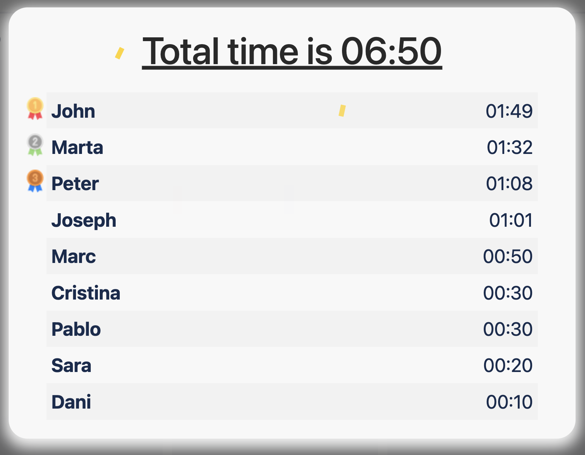

# Jira Standup Monitor 

Ramondly decides who's next on standups

## Installation

- Clone the repository
- Go to chrome://extensions/
- Toggle on the "Developer mode" switch on the top right menu
- Click on the "Load unpacked" button on the top left and choose the folder of the cloned repository
- (Optional) Pin the extension for easy access

That's it, you are ready to use it :)

## User Guide Jira Standup Monitor

- Go to JIRA_BASE_URL/secure/RapidBoard.jspa
- Check all the team members are on a quick filter label
- Open the extension.
- Click "Show player" to display the player on top of the JIRA board.
- A player with the functions (postpone, previous, start/show results, next, skip) will appear
- At any moment, you can click on "Clear data" to reset everything so you can start again.

## User Guide Sprint Data Extractor

- Genereate a token on the Token Viewer section of the Debug UI of your tenant
- Open your terminal(mac, linux or git bash) and set your token variable that will be used later.
- Replace the variables JIRA_BASE_URL, TENANT_BASE_URL & TENANT_TOKEN for your own ones
- Go to the JIRA_BASE_URL Backlog.
- Verify there is no filter applied(name, team, etc).
- Ensure there are no ongoing or irrelevant tasks on the sprint, otherwise they will be counted in the final amount.
- Identify the title of the sprint you want to extract the data, such as Sprint 561.
- Open the extension and click on Sprint Data Extractor

   

- Select the sprint you want on the dropdown
- Now let's focus on the two main functions:
  - Copy Dashboard Cmd => Clicking on this button copies a curl command to generate the data of the dashboard, you just need to paste it to the same terminal you set your TENANT_TOKEN variable and the Dashboard will be created
    - Afterwards, you can go to the Dashboards list of your tenant and find the Dashboard with the name you got on the output of the command. Dashboard will look similar to this one
       
      Now you just need to fill the data of the pie chart visualization
       
  - Copy Metric Cmd => Clicking on this button copies a curl command to generate the data of the pie chart of your dashboard, you just need to paste it to the same terminal you set your TENANT_TOKEN variable

That's it! You have the base of your Dashboard (Title, Tags, Pie, Summary, Backports to PROD, Researches, Features divided by epic and links to the JIRA and the sprints). Now you can iterate over it if you want to make it prettier :)

## CHANGELOG

See changes [here](CHANGELOG.md)
